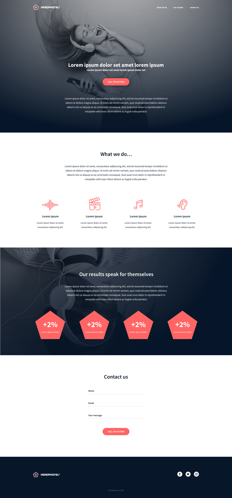

# holbertonschool-headphones

## Implement a design from scratch

This is a web page project created from scratch, without any library, framework. In this project all the HTML/CSS/Accessibility/Responsive design knowledge acquired previously is used.

### Here the final result:

### Screenshot

## Install

* Clone this repository: `https://github.com/alejuran/holbertonschool-headphones.git`

## Technologies

## About Myself

I am a software developer with a passion for technology and an insatiable curiosity for understanding how things work from the inside.

My experience spans a wide range of technologies, including HTML, CSS, Python, C, JavaScript, React, Django, Flask, Bootstrap, MySQL, MongoDB, Git, Sass, linux and terminal commands. 

I'm always excited to keep learning and discovering new tools and technologies. I love collaborating on challenging projects and finding innovative solutions to problems. Programming for me is more than a job, it's an art form that allows me to bring ideas to life and create impactful digital experiences.

## Bugs
No known bugs at this time. 

## Author

Alejanro Urán

